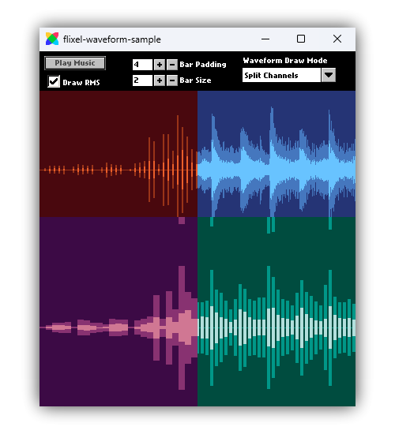

# flixel-waveform

A simple yet powerful [HaxeFlixel](https://haxeflixel.com/) addon for drawing waveforms from sounds.

    

Take a look at [the example project](https://github.com/ACrazyTown/flixel-waveform/tree/main/samples/basic) for a showcase and explanation of how to use the library.

If you have any questions/issues/ideas, do not hesitate to [open an issue on GitHub](https://github.com/ACrazyTown/flixel-waveform/issues/new).

## Installation 

1. To install the library, run the following command in your terminal:
    - For the latest stable release, run `haxelib install flixel-waveform`
    - For the latest development and possibly unstable version, install from git: `haxelib git flixel-waveform https://github.com/ACrazyTown/flixel-waveform`

2. Include the library in your Project.xml: `<haxelib name="flixel-waveform" />`

Any targets that HaxeFlixel supports should also be supported by this library.
