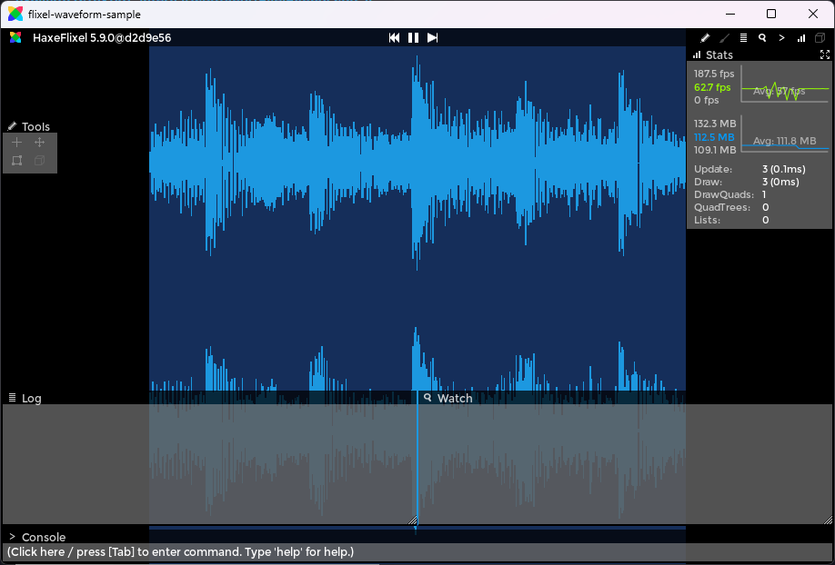

# flixel-waveform
This is an addon for [HaxeFlixel](https://github.com/HaxeFlixel/flixel)

A simple (I hope) `FlxSprite` extension that allows for rendering waveforms from audio.

**Check out the [sample](https://github.com/ACrazyTown/flixel-waveform/tree/main/samples/basic/) for instructions on how to use.**

## Installation

1. Install via haxelib git: `haxelib git flixel-waveform https://github.com/ACrazyTown/flixel-waveform`

2. And then include it in your Project.xml: `<haxelib name="flixel-waveform">`

3. Finally, import it in your code when needed: `import flixel.addons.display.waveform.FlxWaveform;`

## Info
### Supported targets
Should work on any target that exposes raw audio buffer data (native targets). Due to the lime handles audio on HTML5/Flash, this addon does not work on those targets. I'm looking into possible solutions.
