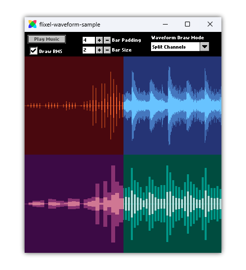

    

---

A simple yet powerful [HaxeFlixel](https://haxeflixel.com/) addon for drawing waveforms from sounds.

    

Play around with the [playground example project](https://acrazytown.github.io/flixel-waveform/) and take a look at its [source code](https://github.com/ACrazyTown/flixel-waveform/tree/main/samples/playground) for a showcase and explanation of how to use the library.

If you have any questions/issues/ideas, do not hesitate to [open an issue on GitHub](https://github.com/ACrazyTown/flixel-waveform/issues/new) or ask away in [the thread on the Haxe discord server](https://discord.com/channels/162395145352904705/1340696952748376075).

## Installation 

1. To install the library, run the following command in your terminal:
    - For the latest stable release, run `haxelib install flixel-waveform`
    - For the latest development and possibly unstable version, install from git: `haxelib git flixel-waveform https://github.com/ACrazyTown/flixel-waveform dev`.
        - The `dev` branch is where development on the next major/minor release is being done.
        - The `main` branch is where patches and bugfixes for the current stable release are being done.

2. Include the library in your Project.xml: `<haxelib name="flixel-waveform" />`

Any targets that HaxeFlixel supports should also be supported by this library.
