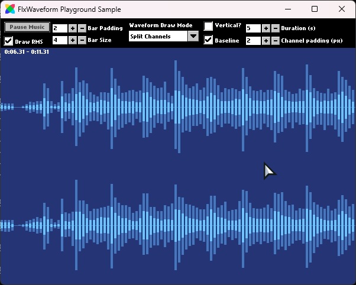

# Playground

The playground sample project features a fun little UI that allows you to tweak the settings of the waveform. It is regularly updated with new features and is meant to serve as a showcase for them.

To visualize a different audio file, you can simply drag and drop your desired audio file to the window. Audio format support depends on the build target. Native targets support only WAV and OGG/Vorbis while HTML5 supports any audio format your browser supports.

    

